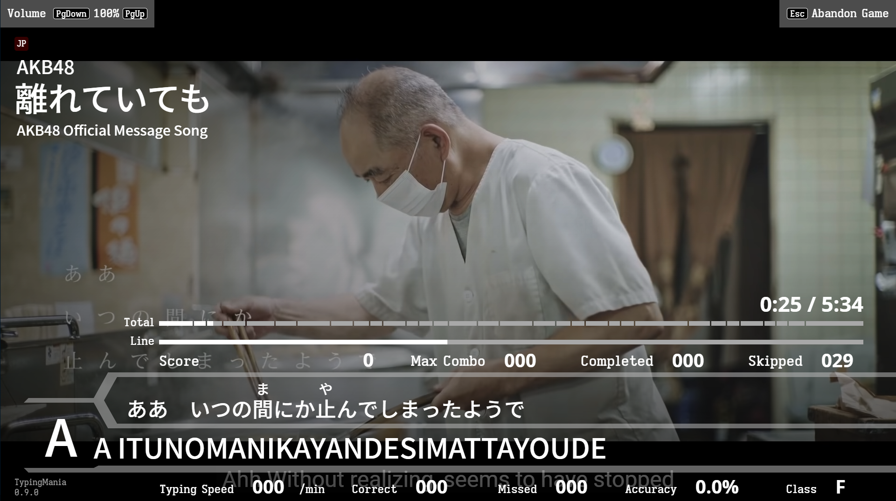
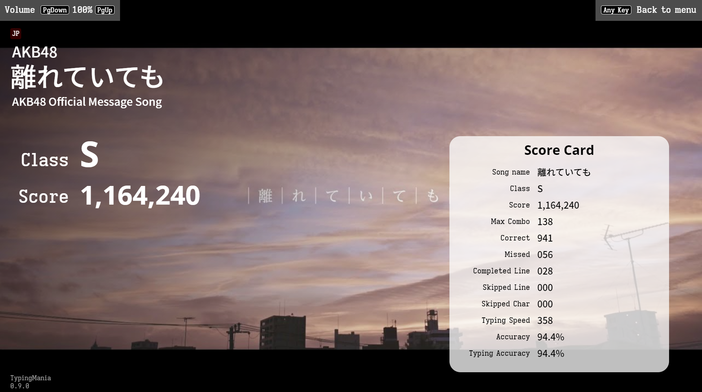

TypingMania NEO
===============

**NOTE: This README is incomplete**

- [x] Game is completed
- [x] Command line script to build song data (from .ass file)
- [ ] ~~Script to convert from the old TypingMania format~~ **Abandoned**
- [x] Preview for song file (See `preview.html`)
- [ ] Dedicated HTML Song Editor
- [x] How to play
- [ ] How to create new song
- [ ] This README File
- [x] Redistributable release (See `npm run build-game`)
- [ ] Initial free song pack
- [x] Demo server
- [ ] Actual GitHub release

----

TypingMania is a song lyric typing game. You can also think of it like
Karaoke, but typing version.

### Highlighted features
- YouTube playback ability
- Japanese lyric lines are more natural (Kanji & Furigana)
- Typing sound feedback
- Can load local song files

Table of Content
----------------
- [How to Play](#how-to-play)
- [Creating New Song](#creating-new-song)
- [Score Calculation](#score-calculation)
- [Supported Browser](#supported-browsers)
- [History](#history)
- [Project Structure](#project-structure)
- [License & Copyright](#license--copyright)
- [日本語](#日本語)

How to Play
-----------

This game is controlled purely by keyboard (because it is a typing game).
There are no mouse interaction available.

### Selecting song

**Top-Left** is the master volume control. Use `PageUp` and `PageDown` key to
change volume level. Note that for YouTube, the volume is only approximated.

**Right** part of the screen is the song list. It shows the artist and song 
title. The square shows the song language, while the color denotes the media 
type:

- **Red** (shown in the picture) means YouTube media.
- **Green** means a video file.
- **Blue** means audio only.

**Left** part shows song detail. It includes artist, song title, song subtitle,
current high score, the song length. It also shows the character-per-minute
of the song, at 90 percentile and the maximum. This can be used to gauge
difficulty of the song.

To navigate the menu, use `Up Arrow` and `Down Arrow`. To enter collection or
select the song to play, use `Enter`. To exit collection, use `Backspace`.

### Using local file

You can drag and drop valid `.typingmania` file to the game to load. Note that
high score is not supported for locally-load file.

### Typing

Basically, just type what is on the screen. You can press `Esc` at any time to
finish the song early.

You can use `Tab` button to skip any line. Note that if you skipped a lyric
that you have not finish typing yet, it will be counted as *skipped*.

The **Total** progressbar show the progress within the song. The **Line**
progressbar show the current progress with in the line.

For Japanese line, even though the shown Romaji might be different, the system
supports almost every possible keypress sequence that will result in that Kana.
For example, にゃ can be input as *nya*, *nixya*, and *nilya*. いっしょ can be
input as *issho*, *ixtsusho*, *ixtushixyo*, etc.

### Score

After the song ended (or `Esc` was pressed), the score summary screen will be
shown with following number:
- **Score/Class**: Refer to [Score calculation](#score-calculation) section.
- **Max Combo**: maximum number of consecutive correct keypresses.
- **Correct**: number of correct keypresses.
- **Missed**: number of incorrect keypresses.
- **Completed Line**: number of lines completed.
- **Skipped Line** number of lines that was not completed (unable to finish
  typing within the time)
- **Skipped Char**: number of characters unable to finished within the time.
- **Accuracy**: your accuracy.
- **Typing Accuracy**: typing accuracy if the skipped char is counted as 
  missed.

Creating New Song
-----------------

### Preparing lyrics and metadata

### Timing the scripts

### Preparing media file

Score Calculation
-----------------

Each character in the song lyrics contains a concept of *scoring characters*.
For Latin characters, the *scoring character* is always 1. For Japanese,
however, this is different. For example, ち may be typed as ti and chi,
but the *scoring character* is always 2. It is always the number of
the shortest possible sequence of keypresses to input that character.

All keypress up to the *scoring character* are used for score
calculation. All further keypress will also be used to calculate
typing speed, but cannot generate any positive score.

For each correct keypress, the score is calculated as
`1000 + CPM Bonus + Combo Bonus`. CPM Bonus is calculated as
`Current Average CPM * 0.25`, and Combo Bonus is just the current combo
chain.

For each incorrect key press, a penalty of 500 points is applied. Note that
this only applies where a lyrics line is active. Extra keypress while waiting
will not generate penalties.

Furthermore, there is also a line bonus. If you can finish a lyrics line,
then you get 10% of the score you gained during that line. If you can
finish the line without any mistake, you gain another 15%.

### Score Class

Classes are award based on the score relative to the base score. The base score
is calculated by: `number_of_char × 1250`, where `number_of_char` refers to the
*scoring character*, or the minimum number of characters required to
complete the song.

  
Score ratio for each class

| Percent  | Class |
| -------- | ----- |
|   > 125% |   SSS |
|   > 110% |    SS |
|   > 105% |    S+ |
|   > 100% |     S |
|    > 95% |    A+ |
|    > 90% |     A |
|    > 85% |    B+ |
|    > 80% |     B |
|    > 75% |    C+ |
|    > 70% |     C |
|    > 60% |    D+ |
|    > 50% |     D |
|    > 40% |    E+ |
|    > 30% |     E |
|    > 20% |    F+ |
|    < 20% |     F |

  
REFERENCE: TypingMania ODYSSEY Score Calculation

The original SightSeeker Studio's TypingMania ODYSSEY score calculation is
very simple. The maximum score is 200,000, and each correct keypress gain you
`200,000 ÷ scoring character`. Each incorrect keypress loss you half of the
gain (`-0.5 * (200,000 ÷ scoring character)`).

Possibly due to a bug in character count calculation, it is possible to get more
than 200,000 points by always typing the longest romaji of each character.

The combo does not affect the score at all.

Supported Browsers
-----------------
- The latest version of Google Chrome and Mozilla Firefox.
- Untested on Microsoft Edge, but should work.
- Safari has a delay between the actual and reported media time,
  resulting in a slight (but noticeable) delay of the lyrics line.

History
-------

Back in 2013, I made a TypingMania Odyssey clone in JavaScript, which is
available in the `master` branch.

That version of TypingMania was almost a direct clone of TypingMania ODYSSEY,
except for the score calculation system which I did not reverse-engineer
at that time.

I have been trying to rewrite this project since 2016, but this attempt in
2020/2021 is the first successful attempt. This comes after a lot of 
advancement in HTML5 technologies, including: Web Audio API, HTML5 Video,
and ES6 module.

The current TypingMania NEO is a pure HTML5 and JavaScript program. No
external libraries were used. The editor, however, use the Preact library.

The Japanese Kana input system is extensively tested using unit tests.

### Different from TypingMania ODYSSEY

- It is written in HTML5 (HTML+JS), so it runs in 2021 after Adobe dropped
  Flash support in December 2020.
- Revamp UI, including changes to correct terminology: Solve -> Skipped,
  Corrected Percent -> Accuracy, etc. Also include split progressbar for song
  total time.
- New score calculation algorithm (see [Score calculation](#score-calculation))
- Maybe better Japanese handling. This version accepts almost all Romaji 
  sequences that result in the same sentence.
- No longer differentiate between lyrics and typing line. *Furigana* must be 
  added to Kanji lyrics. Most other symbols are converted automatically to typable text.
- Add sound effect for typing/missed/skipped line.
- Can skip line using `Tab` key.
- Can load local file.
- **Can load video directly from YouTube**

### Different from original TypingMania

- Different score calculation.
- No auto-play mode.
- Better performance. This is much faster than the older version.
- Since the original TypingMania was an ODYSSEY clone, all ODYSSEY differences
  also apply.

Project Structure
-----------------
- `assets/raw` folder contains the actual assets file used.
- `assets/assets.dat` is packed assets file. This can be generated with
  `npm run build-assets`
- `data/songs.json` is the main song index file. I suggest putting all songs 
  file (.typingmania) under this folder, but it is not required.
- `docs` contains documentation-related material.
- `latin-table` is a folder containing transliterating table for the game.
  Check `README` in that folder for more detail.
- `scripts` contains nodejs scripts for processing game media, etc.
- `src` is the main source code folder.

License & Copyright
--------------------
The code and assets are copyrighted under the term of the Apache 2.0 license.

This game uses [Dustyroom Casual Game Sound - One Shot SFX Pack](http://dustyroom.com/free-casual-game-sounds/).

This game also uses the Iosevka Etoile, Noto Sans CJK JP, and Open Sans fonts.
Iosevka font family is licensed under SIL Open Font License. Noto Sans and
Open Sans font families are licensed under the Apache 2.0 License.

When creating a song to use with the game, make sure you have the proper right
to the video/audio used. TypingMania NEO and its developer does not take
responsibility for managing the copyright of any content used by the user.

日本語
------
TypingMania NEOは歌の歌詞に合わせてタイピングするタイピングソフトです。元々のTypingMania ODYSSEYは
SightSeeker Studioによる開発し、残念ながら2009年に開発中止しまいました。SightSeeker Studioの
TypingManiaはAdobe Flashで開発しました。

2013年に、私はHTML5によるTypingManiaのパクリのソフトを開発し、2021年にこのTypingMania NEOを完成しました。
HTML5でどんなブラウザにもプレイをでき、YouTubeの音源としても利用できるようにしました。2020年をもって
Adobe Flashサポート終了を伴い、TypingMania ODYSSEYはプレイできなくなり、TypingMania NEOを誕生しました。

### 対応ブラウザ
- 最新型のGoogle Chrome, Mozilla Firefox
- Safariの音声はちょっと遅れて、歌詞のタイミングが合わない場合が多い。

